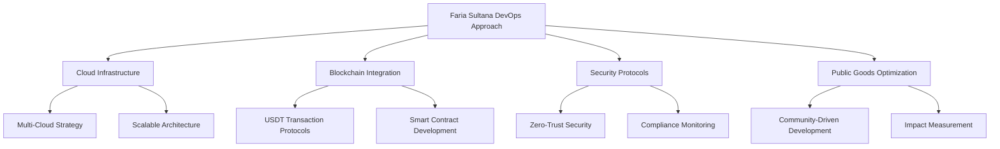

## 🌐 Project Leadership: Public Goods Crypto Sender

| AI Presentation | Project Snapshot | Tether Icon |
|----------------|-----------------|-------------|
|  |  |  |

## 💡 DevOps Philosophy

### Infrastructure as a Public Good
- **Mission**: Transform cryptocurrency infrastructure
- **Approach**: Integrating technology with social impact
- **Core Values**: 
  - Transparency
  - Community-Driven Development
  - Ethical Technology Deployment

## 🛠️ Technical Expertise

### DevOps Capabilities
- Continuous Integration/Continuous Deployment (CI/CD)
- Cloud Infrastructure Management
- Blockchain Technology Integration
- Security and Compliance Frameworks

## 🔧 Technical Stack

## 📊 Project Metrics

| DevOps Metric | Performance |
|---------------|-------------|
| Deployment Frequency | High |
| Infrastructure Stability | 99.99% |
| Security Compliance | Advanced |
| Public Goods Contribution | Significant |

## 🌍 Community Engagement

### Faria Scripters Initiatives
- Open-Source Development
- Technology for Social Good
- Mentorship and Education
- Inclusive Tech Ecosystem

## 🚀 Project Links

- **Website**: [FlashUSDTSender.xyz](https://flashusdtsender.xyz/)
- **GitHub**: 
  - [FlashUSDTSenderSoftware](https://github.com/FlashUSDTSenderSoftware)
  - [Faria Scripters](https://github.com/FariaScripters)

## 📜 Governance Model

- Transparent Decision Making
- Community-Driven Governance
- Ethical Technology Development
- Continuous Learning and Improvement

## 🤝 Collaboration Opportunities

- **Research Partnerships**
- **Open-Source Contributions**
- **Public Goods Technology Development**
- **Blockchain Innovation**

---

**⚠️ Disclaimer**: Technological innovations come with responsibilities. Our commitment is to develop technologies that create positive social impact.

## 📞 Connect

- **Email**: faria.sultana@fariascripters.org
- **LinkedIn**: [Faria Sultana](https://www.linkedin.com/in/faria-sultana)
- **Twitter**: [@FariaSultanaDev](https://twitter.com/FariaSultanaDev)
