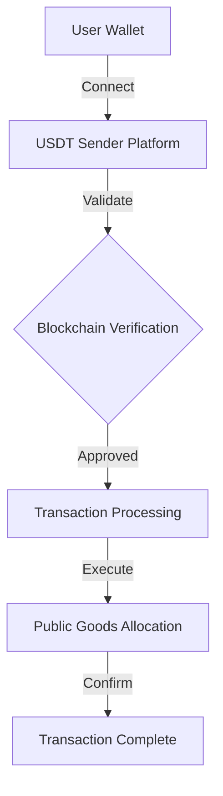

# 🌐 Flash USDT Sender: Public Goods Crypto Innovation

## 🚀 Project Visualization

## 💡 Core Concept

Flash USDT Sender represents a cutting-edge platform bridging cryptocurrency technologies with public goods infrastructure, designed to revolutionize digital transactions and social impact.

## 🖼️ Project Imagery

| AI Visualization | Technical Snapshot | Tether Icon |
|-----------------|-------------------|-------------|
|  |  |  |

## 🌍 Quick Access Points

- ** website**: [FlashUSDTSender.xyz](https://flashusdtsender.xyz/)
- **💻 GitHub**: [FlashUSDTSenderSoftware](https://github.com/FlashUSDTSenderSoftware)

## ✨ Key Features

1. **Ultra-Fast USDT Transactions**
   - Lightning-speed cryptocurrency transfers
   - Minimal transaction latency
   - Secure blockchain integration

2. **Public Goods Focus**
   - Direct contribution to community projects
   - Transparent fund allocation
   - Social impact optimization

3. **Advanced Security Protocols**
   - Multi-layer encryption
   - Wallet authentication
   - Risk mitigation strategies

## 🔧 Technical Architecture

## 💰 Transaction Mechanics

| Parameter | Specification |
|-----------|---------------|
| Supported Cryptocurrency | USDT |
| Transaction Speed | <50 seconds |
| Security Level | High |
| Public Goods Contribution | Configurable Percentage |

## 🚀 Quickstart Guide

### Prerequisites
- Cryptocurrency Wallet
- USDT Holdings
- Modern Web Browser
- Stable Internet Connection

### Installation Steps
1. Visit [FlashUSDTSender.xyz](https://flashusdtsender.xyz/)
2. Connect Your Cryptocurrency Wallet
3. Select Transaction Parameters
4. Confirm Public Goods Allocation
5. Execute Transaction

## 🤝 Community Engagement

- Open-Source Development
- Transparent Governance
- Community-Driven Innovation
- Regular Public Reporting

## ⚖️ Compliance & Transparency

- KYC/AML Compliant
- Regular Security Audits
- Regulatory Framework Adherence

## 📜 Licensing

Public Goods Open Source License v1.0
- Free Usage
- Collaborative Development
- Social Impact Focused

---

**⚠️ Disclaimer**: Cryptocurrency transactions involve risks. Always conduct thorough research and understand potential financial implications.

## 📞 Contact & Support

- **Email**: support@flashusdtsender.xyz
- **Community Forum**: [Community Discussion Platform]
- **Bug Reporting**: GitHub Issues

